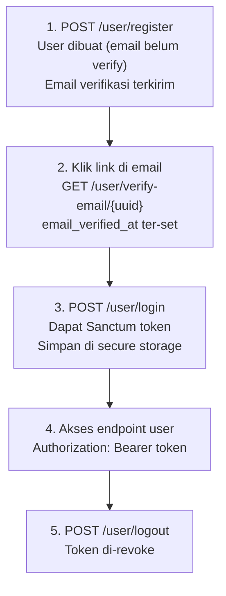
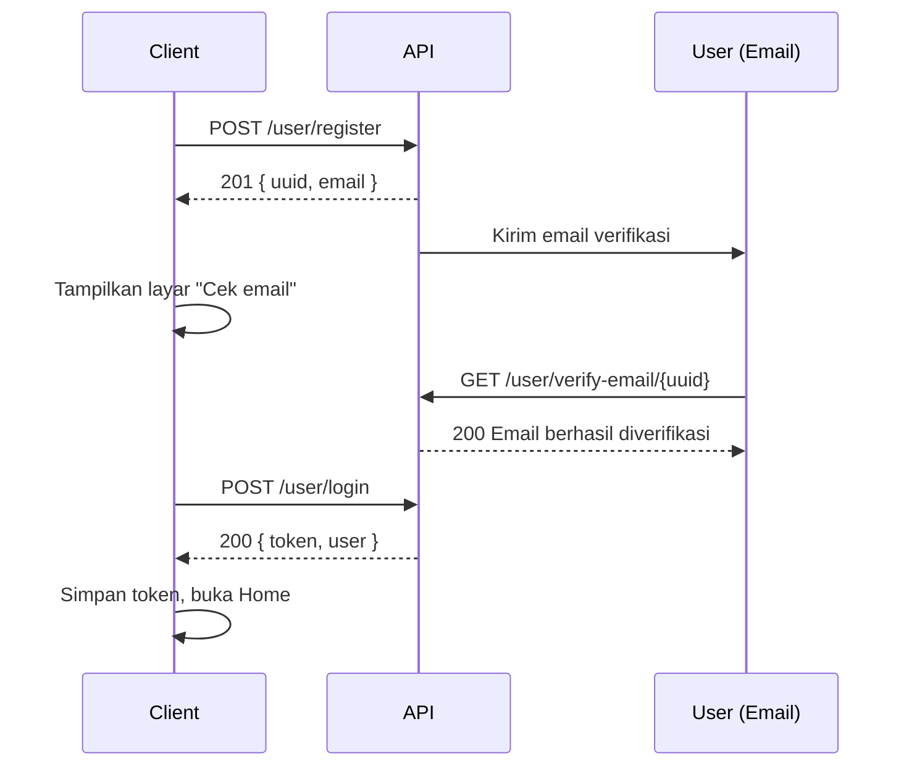

# Ovisito User API

> Dokumentasi lengkap User API untuk integrasi multi-platform (**Web**, **Android**, **iOS**).

| | |
|---|---|
| **Versi** | 1.0 |
| **Base URL** | `https://api.ovisito.com/api/v2` |
| **Prefix** | `/user/*` |
| **Controller** | `Api\User\UserController` |
| **Total endpoint** | 20 |
| **Status API** | `GET https://api.ovisito.com/api/v2/ping` |
| **Health check** | `GET https://api.ovisito.com/up` |
| **Kontak** | backend@ovisito.com |

---

## Daftar Isi

1. [Quick Start](#1-quick-start)
2. [Overview](#2-overview)
3. [Authentication Flow](#3-authentication-flow)
4. [Konvensi Umum](#4-konvensi-umum)
5. [Penanganan Error](#5-penanganan-error)
6. [Ringkasan Endpoint](#6-ringkasan-endpoint)
7. [Endpoint — Auth](#7-endpoint--auth)
8. [Endpoint — Verifikasi Email](#8-endpoint--verifikasi-email)
9. [Endpoint — Password](#9-endpoint--password)
10. [Endpoint — Profil](#10-endpoint--profil)
11. [Endpoint — Home](#11-endpoint--home)
12. [Endpoint — Booking](#12-endpoint--booking)
13. [Endpoint — Notifikasi](#13-endpoint--notifikasi)
14. [Endpoint — Wishlist](#14-endpoint--wishlist)
15. [Endpoint — Chat Session](#15-endpoint--chat-session)
16. [Rate Limiting](#16-rate-limiting)
17. [Catatan Integrasi](#17-catatan-integrasi)
18. [Contoh Alur (Sample Flows)](#18-contoh-alur-sample-flows)
19. [Changelog](#19-changelog)
20. [Item yang Perlu Dikonfirmasi](#20-item-yang-perlu-dikonfirmasi)

---

## 1. Quick Start

Login dan ambil profil dalam dua request:

```bash
# 1. Login
curl -X POST https://api.ovisito.com/api/v2/user/login \
  -H "X-Client-ID: client_web" \
  -H "X-Client-Secret: <secret>" \
  -H "Accept: application/json" \
  -H "Content-Type: application/json" \
  -d '{"email":"budi@example.com","password":"password123","device_name":"web-user"}'

# 2. Ambil profil memakai token dari langkah 1
curl https://api.ovisito.com/api/v2/user/profile \
  -H "X-Client-ID: client_web" \
  -H "X-Client-Secret: <secret>" \
  -H "Accept: application/json" \
  -H "Authorization: Bearer 1|abcdefghijklmnopqrstuvwxyz1234567890"
```

---

## 2. Overview

### 2.1 Role & Akses

| Role | Header Tambahan | Token |
|------|-----------------|-------|
| **Public** (browsing) | `X-Client-ID`, `X-Client-Secret` | Tidak perlu |
| **User** (end-user / pembeli) | `X-Client-ID`, `X-Client-Secret` + `Authorization: Bearer` | Sanctum token |

Dokumen ini fokus pada **User API**, untuk end-user/pembeli yang menggunakan aplikasi Ovisito.

### 2.2 Base URL

| Environment | URL |
|-------------|-----|
| Production | `https://api.ovisito.com/api/v2` |
| Staging | `https://staging-api.ovisito.com/api/v2` |
| Local | `http://localhost:8000/api/v2` |

### 2.3 Header Wajib

Setiap request **wajib** menyertakan:

```http
X-Client-ID: client_web
X-Client-Secret: <secret_dari_backend_team>
Accept: application/json
```

Untuk endpoint yang membutuhkan login, tambahkan:

```http
Authorization: Bearer <token>
```

### 2.4 Content-Type

| Endpoint | Content-Type |
|----------|--------------|
| Register, Login, Logout | `application/json` |
| Forgot / Reset Password | `application/json` |
| Change Password | `application/json` |
| Update Profile | `multipart/form-data` atau `application/json` |

---

## 3. Authentication Flow



### 3.1 Token Management

| Aspek | Nilai |
|-------|-------|
| Tipe | Laravel Sanctum Personal Access Token |
| Format | `{id}\|{token}`, contoh `1\|abcdefg...` |
| Masa berlaku | Selamanya (tidak ada expiry otomatis) |
| Revoke | Via `POST /user/logout` |
| Storage (Web) | Server-side session (**bukan** localStorage) |
| Storage (Android) | `EncryptedSharedPreferences` |
| Storage (iOS) | Keychain |
| Header | `Authorization: Bearer {token}` |

> ⚠️ **Keamanan mobile**
> - Jangan simpan token di `SharedPreferences` / `UserDefaults` biasa.
> - Jangan log token ke console atau crash report.
> - Token otomatis di-revoke saat password diganti.

---

## 4. Konvensi Umum

### 4.1 Format Response — Sukses

**Single object**

```json
{
  "status": true,
  "message": "Optional message",
  "data": {
    "id": "...",
    "name": "..."
  }
}
```

**List / paginated**

```json
{
  "status": true,
  "data": [],
  "meta": {
    "current_page": 1,
    "last_page": 5,
    "per_page": 15,
    "total": 60
  }
}
```

### 4.2 Format Response — Error

```json
{
  "status": false,
  "message": "Pesan error yang jelas",
  "errors": {
    "field_name": ["Pesan error field"]
  }
}
```

> Field `errors` hanya muncul pada **422 Validation Error**.

### 4.3 HTTP Status Codes

| Code | Arti | Kapan |
|------|------|-------|
| `200` | OK | Request sukses |
| `201` | Created | Resource baru dibuat (register, tambah wishlist) |
| `400` | Bad Request | Request tidak valid |
| `401` | Unauthorized | Token tidak ada / invalid / sudah di-revoke |
| `403` | Forbidden | Token valid tapi tidak punya akses (mis. email belum verify) |
| `404` | Not Found | Resource tidak ditemukan |
| `422` | Validation Error | Body request tidak lulus validasi |
| `429` | Too Many Requests | Rate limit terlampaui |
| `500` | Internal Server Error | Bug di backend |
| `502` | Bad Gateway | Upstream error |

### 4.4 Pagination

| Param | Tipe | Default | Max |
|-------|------|---------|-----|
| `page` | int | `1` | — |
| `per_page` | int | `15` | `50` |

### 4.5 Format Data

| Data | Format | Contoh |
|------|--------|--------|
| Tanggal-waktu | ISO 8601 UTC | `2026-10-08T10:30:00.000000Z` |
| Tanggal | `YYYY-MM-DD` | `2026-10-08` |
| Uang | String decimal | `"50000.00"` |
| Uang (formatted) | String Rupiah | `"Rp 50.000"` |
| Boolean | `true` / `false` | `true` |
| ID | UUID v4 | `01a0e882-b4fe-...` |

---

## 5. Penanganan Error

Semua error mengikuti pola yang sama:

```json
{
  "status": false,
  "message": "Pesan error"
}
```

| Status | Kondisi | Aksi di client |
|--------|---------|----------------|
| `401` | Token invalid / sudah di-revoke | Hapus token, redirect ke login |
| `403` + `EMAIL_NOT_VERIFIED` | Email belum diverifikasi | Redirect ke halaman verifikasi |
| `404` | Resource tidak ditemukan | Tampilkan pesan "tidak ditemukan" |
| `422` | Validasi gagal | Tampilkan pesan per field dari `errors` |
| `429` | Rate limit | Tunggu lalu coba lagi |
| `500` | Server error | Tampilkan pesan umum, coba lagi nanti |

<details>
<summary><strong>Contoh response untuk tiap error</strong></summary>

**401 — Unauthenticated**

```json
{
  "status": false,
  "message": "Unauthenticated. Silakan login terlebih dahulu."
}
```

**403 — Email belum verify**

```json
{
  "status": false,
  "message": "Silakan verifikasi email Anda terlebih dahulu.",
  "data": { "code": "EMAIL_NOT_VERIFIED" }
}
```

**404 — Not found**

```json
{
  "status": false,
  "message": "Data tidak ditemukan."
}
```

**422 — Validation error**

```json
{
  "status": false,
  "message": "Validasi gagal.",
  "errors": {
    "email": ["Email sudah terdaftar."]
  }
}
```

**429 — Rate limit**

```json
{
  "status": false,
  "message": "Too Many Attempts."
}
```

**500 — Server error**

```json
{
  "status": false,
  "message": "Terjadi kesalahan pada server."
}
```

</details>

---

## 6. Ringkasan Endpoint

| # | Method | URI | Auth | Fungsi |
|---|--------|-----|:----:|--------|
| 1 | `POST` | `/user/register` | ❌ | Registrasi user baru |
| 2 | `POST` | `/user/login` | ❌ | Login, dapat token |
| 3 | `POST` | `/user/logout` | ✅ | Revoke token aktif |
| 4 | `GET` | `/user/verify-email/{uuid}` | ❌ | Verifikasi email via link |
| 5 | `POST` | `/user/resend-verification` | ❌ | Kirim ulang email verifikasi |
| 6 | `POST` | `/user/forgot-password` | ❌ | Minta link reset password |
| 7 | `POST` | `/user/reset-password` | ❌ | Reset password dengan token |
| 8 | `PUT` | `/user/change-password` | ✅ | Ganti password |
| 9 | `GET` | `/user/profile` | ✅ | Ambil profil |
| 10 | `PUT` | `/user/profile` | ✅ | Update profil / avatar |
| 11 | `GET` | `/user/home` | ✅ | Data beranda |
| 12 | `GET` | `/user/bookings` | ✅ | List booking |
| 13 | `GET` | `/user/bookings/{id}` | ✅ | Detail booking |
| 14 | `GET` | `/user/notifications` | ✅ | List notifikasi |
| 15 | `PUT` | `/user/notifications/{id}/read` | ✅ | Tandai satu notifikasi dibaca |
| 16 | `PUT` | `/user/notifications/read-all` | ✅ | Tandai semua dibaca |
| 17 | `GET` | `/user/wishlist` | ✅ | List wishlist |
| 18 | `POST` | `/user/wishlist` | ✅ | Tambah ke wishlist |
| 19 | `DELETE` | `/user/wishlist/{id}` | ✅ | Hapus dari wishlist |
| 20 | `GET` | `/user/chat-session` | ✅ | Ambil / buat sesi chat |

---

## 7. Endpoint — Auth

### 7.1 `POST /user/register`

Registrasi user baru.

- **Auth:** tidak perlu token
- **Content-Type:** `application/json`

**Request body**

```json
{
  "name": "Budi Santoso",
  "email": "budi@example.com",
  "password": "password123",
  "password_confirmation": "password123",
  "phone": "081234567890"
}
```

**Validasi**

| Field | Tipe | Wajib | Deskripsi |
|-------|------|:-----:|-----------|
| `name` | string | ✅ | Maks. 255 karakter |
| `email` | email | ✅ | Maks. 255 karakter, unik |
| `password` | string | ✅ | Min. 8 karakter, harus ada `password_confirmation` |
| `phone` | string | ❌ | Maks. 20 karakter |

**Response `201 Created`**

```json
{
  "status": true,
  "message": "Registrasi berhasil. Silakan cek email untuk verifikasi.",
  "data": {
    "uuid": "01a0e882-b4fe-737c-8936-68152828b651",
    "email": "budi@example.com"
  }
}
```

**Response `422`**

```json
{
  "status": false,
  "message": "Validasi gagal.",
  "errors": {
    "email": ["Email sudah terdaftar."]
  }
}
```

---

### 7.2 `POST /user/login`

Login user dan dapatkan token Sanctum.

- **Auth:** tidak perlu token
- **Content-Type:** `application/json`

**Request body**

```json
{
  "email": "budi@example.com",
  "password": "password123",
  "device_name": "web-user"
}
```

**Rekomendasi `device_name`**

| Platform | `device_name` |
|----------|---------------|
| Android | `android-user` atau `android-{Build.MODEL}` |
| iOS | `ios-user` atau `ios-{UIDevice.current.name}` |
| Web | `web-user` |

**Response `200`**

```json
{
  "status": true,
  "message": "Login berhasil.",
  "data": {
    "token": "1|abcdefghijklmnopqrstuvwxyz1234567890",
    "user": {
      "uuid": "01a0e882-b4fe-737c-8936-68152828b651",
      "name": "Budi Santoso",
      "email": "budi@example.com",
      "phone": "081234567890",
      "email_verified_at": "2026-10-08T10:00:00.000000Z"
    }
  }
}
```

**Response `403` — Email belum diverifikasi**

```json
{
  "status": false,
  "message": "Silakan verifikasi email Anda terlebih dahulu.",
  "data": { "code": "EMAIL_NOT_VERIFIED" }
}
```

**Response `422` — Kredensial salah**

```json
{
  "status": false,
  "message": "Validasi gagal.",
  "errors": {
    "email": ["Email atau password salah."]
  }
}
```

---

### 7.3 `POST /user/logout`

Revoke token aktif.

- **Auth:** ✅ Bearer token
- **Content-Type:** `application/json`

**Response `200`**

```json
{
  "status": true,
  "message": "Logout berhasil."
}
```

> Setelah logout, hapus token dan data user dari storage client.

---

## 8. Endpoint — Verifikasi Email

### 8.1 `GET /user/verify-email/{uuid}`

Verifikasi email melalui link yang dikirim ke email user.

- **Auth:** tidak perlu token (link dari email)

**Path parameter**

| Param | Tipe | Deskripsi |
|-------|------|-----------|
| `uuid` | uuid | UUID user |

**Response `200`**

```json
{
  "status": true,
  "message": "Email berhasil diverifikasi."
}
```

**Response `403`**

```json
{
  "status": false,
  "message": "Hash verifikasi tidak valid."
}
```

**Response `404`**

```json
{
  "status": false,
  "message": "Link verifikasi tidak valid."
}
```

---

### 8.2 `POST /user/resend-verification`

Kirim ulang email verifikasi.

- **Auth:** tidak perlu token
- **Content-Type:** `application/json`

**Request body**

```json
{
  "email": "budi@example.com"
}
```

**Response `200`**

```json
{
  "status": true,
  "message": "Jika email terdaftar dan belum diverifikasi, link baru telah dikirim."
}
```

> ⚠️ Response **selalu sukses** (anti user-enumeration).

---

## 9. Endpoint — Password

### 9.1 `POST /user/forgot-password`

Minta link reset password via email.

- **Auth:** tidak perlu token
- **Content-Type:** `application/json`

**Request body**

```json
{
  "email": "budi@example.com"
}
```

**Response `200`**

```json
{
  "status": true,
  "message": "Jika email terdaftar, link reset password telah dikirim."
}
```

> ⚠️ Response **selalu sukses** (anti user-enumeration).

---

### 9.2 `POST /user/reset-password`

Reset password menggunakan token dari email.

- **Auth:** tidak perlu token
- **Content-Type:** `application/json`

**Request body**

```json
{
  "token": "abcdefghij...",
  "email": "budi@example.com",
  "password": "newpassword456",
  "password_confirmation": "newpassword456"
}
```

**Response `200`**

```json
{
  "status": true,
  "message": "Password berhasil direset. Silakan login."
}
```

**Response `422` — Token invalid / kadaluarsa**

```json
{
  "status": false,
  "message": "Token reset tidak valid atau sudah kadaluarsa."
}
```

> ⚠️ Setelah reset, **semua token Sanctum lama di-revoke**. User harus login ulang.

---

### 9.3 `PUT /user/change-password`

Ganti password saat sudah login.

- **Auth:** ✅ Bearer token
- **Content-Type:** `application/json`

**Request body**

```json
{
  "current_password": "password123",
  "new_password": "newpassword456",
  "new_password_confirmation": "newpassword456"
}
```

**Aturan**

- `new_password` minimal 8 karakter.
- Harus ada `new_password_confirmation` yang sama.
- Password baru tidak boleh sama dengan password lama.

**Response `200`**

```json
{
  "status": true,
  "message": "Password berhasil diubah."
}
```

**Response `422` — Password lama salah**

```json
{
  "status": false,
  "message": "Password saat ini salah."
}
```

> ⚠️ Setelah ganti password, **semua token lain di-revoke** (device lain otomatis logout).

---

## 10. Endpoint — Profil

### 10.1 `GET /user/profile`

Ambil data profil user.

- **Auth:** ✅ Bearer token

**Response `200`**

```json
{
  "status": true,
  "data": {
    "uuid": "01a0e882-b4fe-737c-8936-68152828b651",
    "name": "Budi Santoso",
    "email": "budi@example.com",
    "phone": "081234567890",
    "avatar": null,
    "email_verified_at": "2026-10-08T10:00:00.000000Z",
    "created_at": "2026-10-01T08:00:00.000000Z",
    "updated_at": "2026-10-08T10:30:00.000000Z"
  }
}
```

> Field `password` dan `remember_token` tidak pernah di-expose.

---

### 10.2 `PUT /user/profile`

Update profil user.

- **Auth:** ✅ Bearer token
- **Content-Type:** `multipart/form-data` (untuk upload avatar) atau `application/json`

**Request body**

| Field | Tipe | Wajib | Deskripsi |
|-------|------|:-----:|-----------|
| `name` | string | ❌ | Maks. 255 karakter |
| `phone` | string | ❌ | Maks. 20 karakter |
| `avatar` | file | ❌ | jpeg / png / jpg / webp, maks. 2 MB |

> Semua field bersifat `sometimes`: kirim **hanya** field yang ingin diubah.

**Response `200`**

```json
{
  "status": true,
  "message": "Profil berhasil diperbarui.",
  "data": {}
}
```

---

## 11. Endpoint — Home

### 11.1 `GET /user/home`

Data beranda user: ringkasan dan konten utama.

- **Auth:** ✅ Bearer token

**Response `200`**

```json
{
  "status": true,
  "data": {
    "user": {
      "uuid": "uuid",
      "name": "Budi Santoso"
    },
    "banners": [],
    "featured_products": [],
    "recent_bookings": [],
    "notifications_count": 3
  }
}
```

> ⚠️ Struktur detail perlu dikonfirmasi dari controller.

---

## 12. Endpoint — Booking

### 12.1 `GET /user/bookings`

List booking user (semua jenis: hotel, kuliner, rental, tour, destinasi, event, transport, dll).

- **Auth:** ✅ Bearer token

**Query parameters**

| Param | Tipe | Default | Deskripsi |
|-------|------|---------|-----------|
| `status` | enum | — | Filter status booking |
| `per_page` | int | `15` | Maks. 50 |
| `page` | int | `1` | — |

**Response `200`**

```json
{
  "status": true,
  "data": [
    {
      "id": "uuid",
      "booking_code": "BK-20261008-ABC123",
      "type": "hotel",
      "status": "paid",
      "status_label": "Dibayar",
      "total_amount": "500000.00",
      "formatted_total": "Rp 500.000",
      "created_at": "2026-10-08T10:30:00.000000Z"
    }
  ],
  "meta": {}
}
```

---

### 12.2 `GET /user/bookings/{id}`

Detail booking user.

- **Auth:** ✅ Bearer token

**Path parameter**

| Param | Tipe | Deskripsi |
|-------|------|-----------|
| `id` | uuid | ID booking |

**Response `200`**

```json
{
  "status": true,
  "data": {
    "id": "uuid",
    "booking_code": "BK-20261008-ABC123",
    "type": "hotel",
    "status": "paid",
    "payment_status": "paid",
    "total_amount": "500000.00",
    "items": [],
    "metadata": {},
    "created_at": "2026-10-08T10:30:00.000000Z"
  }
}
```

**Response `404`**

```json
{
  "status": false,
  "message": "Booking tidak ditemukan."
}
```

---

## 13. Endpoint — Notifikasi

### 13.1 `GET /user/notifications`

List notifikasi user.

- **Auth:** ✅ Bearer token

**Response `200`**

```json
{
  "status": true,
  "data": [
    {
      "id": "uuid",
      "title": "Pesanan Dibayar",
      "message": "Pesanan Anda telah dibayar.",
      "is_read": false,
      "read_at": null,
      "created_at": "2026-10-08T10:30:00.000000Z"
    }
  ],
  "meta": {}
}
```

---

### 13.2 `PUT /user/notifications/{id}/read`

Tandai satu notifikasi sebagai sudah dibaca.

- **Auth:** ✅ Bearer token

**Response `200`**

```json
{
  "status": true,
  "message": "Notifikasi ditandai sudah dibaca."
}
```

---

### 13.3 `PUT /user/notifications/read-all`

Tandai semua notifikasi sebagai sudah dibaca.

- **Auth:** ✅ Bearer token

**Response `200`**

```json
{
  "status": true,
  "message": "Semua notifikasi ditandai sudah dibaca."
}
```

---

## 14. Endpoint — Wishlist

### 14.1 `GET /user/wishlist`

List produk favorit user.

- **Auth:** ✅ Bearer token

**Response `200`**

```json
{
  "status": true,
  "data": [
    {
      "id": "uuid",
      "product": {
        "id": "uuid",
        "name": "Kopi Aceh Gayo",
        "slug": "kopi-aceh-gayo",
        "price": "50000.00",
        "images": ["souvenir/products/xyz.jpg"]
      },
      "created_at": "2026-10-08T10:30:00.000000Z"
    }
  ],
  "meta": {}
}
```

---

### 14.2 `POST /user/wishlist`

Tambah produk ke wishlist.

- **Auth:** ✅ Bearer token
- **Content-Type:** `application/json`

**Request body**

```json
{
  "product_id": "uuid"
}
```

**Response `201`**

```json
{
  "status": true,
  "message": "Produk ditambahkan ke wishlist."
}
```

---

### 14.3 `DELETE /user/wishlist/{id}`

Hapus produk dari wishlist.

- **Auth:** ✅ Bearer token

**Path parameter**

| Param | Tipe | Deskripsi |
|-------|------|-----------|
| `id` | uuid | ID wishlist **atau** ID produk |

**Response `200`**

```json
{
  "status": true,
  "message": "Produk dihapus dari wishlist."
}
```

---

## 15. Endpoint — Chat Session

### 15.1 `GET /user/chat-session`

Ambil atau buat sesi chat user (dengan customer service / chatbot).

- **Auth:** ✅ Bearer token

**Response `200`**

```json
{
  "status": true,
  "data": {
    "session_id": "uuid",
    "user_id": "uuid",
    "status": "active",
    "created_at": "2026-10-08T10:30:00.000000Z"
  }
}
```

> ⚠️ Detail perlu dikonfirmasi dari controller.

---

## 16. Rate Limiting

| Endpoint | Limit |
|----------|-------|
| Semua endpoint | 120 req/menit (default) |
| `POST /user/login` | 5 req/menit |
| `POST /user/register` | 10 req/menit |
| `POST /user/forgot-password` | 3 req/menit |
| `POST /user/reset-password` | 5 req/menit |

Response saat limit terlampaui:

```http
HTTP/1.1 429 Too Many Requests
```

```json
{
  "status": false,
  "message": "Too Many Attempts."
}
```

---

## 17. Catatan Integrasi

### 17.1 Web (Laravel Blade)

```php
$response = Http::withToken($token)->get($url);

if ($response->status() === 401) {
    Session::forget('user_token');
    return redirect()->route('user.login');
}
```

### 17.2 Android (Kotlin + Retrofit)

```kotlin
interface UserApi {
    @POST("user/login")
    suspend fun login(@Body req: LoginRequest): ApiResponse<LoginData>

    @GET("user/profile")
    suspend fun getProfile(): ApiResponse<User>

    @GET("user/bookings")
    suspend fun getBookings(
        @Query("status") status: String? = null,
        @Query("page") page: Int = 1,
        @Query("per_page") perPage: Int = 15,
    ): ApiResponse<List<Booking>>
}
```

Simpan token di `EncryptedSharedPreferences`.

### 17.3 iOS (Swift + URLSession)

```swift
class APIClient {
    static let shared = APIClient()
    private let baseURL = "https://api.ovisito.com/api/v2"

    func request<T: Decodable>(
        _ endpoint: String,
        method: String = "GET",
        body: [String: Any]? = nil
    ) async throws -> T {
        var request = URLRequest(url: URL(string: "\(baseURL)/\(endpoint)")!)
        request.httpMethod = method
        request.setValue("application/json", forHTTPHeaderField: "Content-Type")
        request.setValue("application/json", forHTTPHeaderField: "Accept")
        request.setValue(Config.clientID, forHTTPHeaderField: "X-Client-ID")
        request.setValue(Config.clientSecret, forHTTPHeaderField: "X-Client-Secret")

        if let token = KeychainService.getToken() {
            request.setValue("Bearer \(token)", forHTTPHeaderField: "Authorization")
        }

        if let body = body {
            request.httpBody = try JSONSerialization.data(withJSONObject: body)
        }

        let (data, response) = try await URLSession.shared.data(for: request)
        // Handle status, decode, dll
    }
}
```

Simpan token di Keychain.

### 17.4 Keamanan Mobile

- Jangan hardcode `client_secret` di source code.
- **Android:** gunakan `local.properties` (exclude dari git).
- **iOS:** gunakan `.xcconfig` (exclude dari git).
- Aktifkan **certificate pinning** untuk production.

---

## 18. Contoh Alur (Sample Flows)

### 18.1 Register → Verify → Login



### 18.2 Lihat Booking

1. `GET /user/bookings` → list semua booking user.
2. `GET /user/bookings/{id}` → detail booking.

### 18.3 Wishlist

1. `GET /user/wishlist` → list produk favorit.
2. `POST /user/wishlist` dengan `{ "product_id": "..." }` → `201`, ditambahkan.
3. `DELETE /user/wishlist/{id}` → `200`, dihapus.

### 18.4 Ganti Password

1. `PUT /user/change-password` dengan `{ current_password, new_password, new_password_confirmation }` → `200`.
2. Token di device lain otomatis di-revoke.

---

## 19. Changelog

### v1.0 — 2026-10-10

- Dokumentasi awal User API.
- Mencakup 20 endpoint dari `Api\User\UserController`.
- Field dan struktur detail perlu dikonfirmasi dari controller & model.

---

## 20. Item yang Perlu Dikonfirmasi

Daftar hal yang masih ditandai belum final di dokumen sumber:

- [ ] Struktur detail response `GET /user/home`
- [ ] Detail response `GET /user/chat-session`
- [ ] Nilai enum `status` untuk filter `GET /user/bookings`
- [ ] Isi `items` dan `metadata` pada detail booking
- [ ] Struktur `meta` pagination pada tiap endpoint list
- [ ] Controller method untuk `PUT /user/notifications/read-all` dan `PUT /user/notifications/{id}/read` (di lampiran masih `...`)
- [ ] Perilaku `DELETE /user/wishlist/{id}`: menerima ID wishlist atau ID produk, sebaiknya dipastikan satu saja
- [ ] Definisi route: `notifications/read-all` harus terdaftar **sebelum** `notifications/{id}/read` agar tidak tertangkap sebagai parameter `{id}`

---

## Lampiran — Daftar Lengkap Route User

| Method | URI | Controller@method |
|--------|-----|-------------------|
| `GET` | `api/v2/user/home` | `UserController@home` |
| `POST` | `api/v2/user/register` | `UserController@register` |
| `POST` | `api/v2/user/login` | `UserController@login` |
| `POST` | `api/v2/user/logout` | `UserController@logout` |
| `POST` | `api/v2/user/forgot-password` | `UserController@forgotPassword` |
| `POST` | `api/v2/user/reset-password` | `UserController@resetPassword` |
| `POST` | `api/v2/user/resend-verification` | `UserController@resendVerification` |
| `GET` | `api/v2/user/verify-email/{uuid}` | `UserController@verifyEmail` |
| `GET` | `api/v2/user/profile` | `UserController@profile` |
| `PUT` | `api/v2/user/profile` | `UserController@updateProfile` |
| `PUT` | `api/v2/user/change-password` | `UserController@changePassword` |
| `GET` | `api/v2/user/bookings` | `UserController@bookings` |
| `GET` | `api/v2/user/bookings/{id}` | `UserController@bookingDetail` |
| `GET` | `api/v2/user/notifications` | `UserController@notifications` |
| `PUT` | `api/v2/user/notifications/read-all` | `UserController@...` |
| `PUT` | `api/v2/user/notifications/{id}/read` | `UserController@...` |
| `GET` | `api/v2/user/chat-session` | `UserController@chatSession` |
| `GET` | `api/v2/user/wishlist` | `UserController@wishlist` |
| `POST` | `api/v2/user/wishlist` | `UserController@addWishlist` |
| `DELETE` | `api/v2/user/wishlist/{id}` | `UserController@removeWishlist` |

**Total: 20 endpoint**
